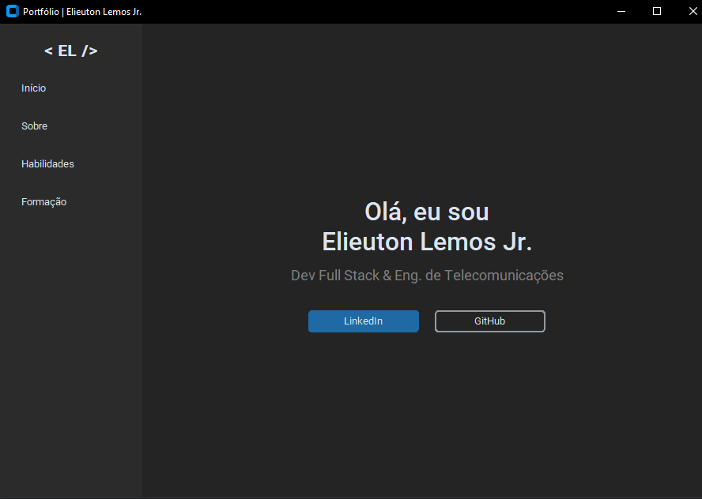
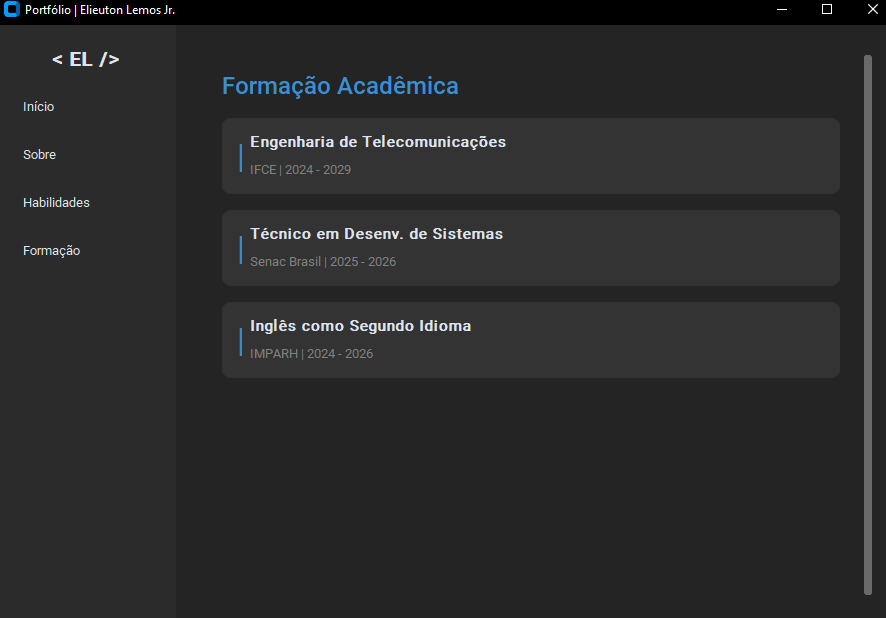

# Portfólio Desktop | Elieuton Lemos Jr.

  

<div align="center">
  
</div>
<br>

<div align="center">
  
</div>
<br>

<div align="center">
  
</div>
<br>

<div align="center">
  
</div>
<br>

## 🖥️ Sobre o Projeto

Este projeto é uma aplicação **Desktop** desenvolvida em Python que funciona como um portfólio interativo.

O objetivo foi demonstrar competências em **Desenvolvimento de Software**, criação de **Interfaces Gráficas (GUI)** modernas e aplicação de conceitos de **Programação Orientada a Objetos (POO)**. Diferente de um site, esta aplicação roda localmente na máquina do usuário, simulando um software corporativo.

> **Nota:** Este projeto foi desenvolvido para demonstrar habilidades técnicas para oportunidades de estágio em TI/Desenvolvimento.

---

## 🎨 Funcionalidades

* **Interface Moderna:** Utiliza a biblioteca `customtkinter` para um visual "Dark Mode" nativo e limpo.
* **Navegação SPA:** Menu lateral que alterna entre as telas sem recarregar a janela.
* **Dados Centralizados:** Todo o conteúdo (textos, experiências) está separado da lógica visual.
* **Interatividade:** Botões funcionais que abrem links externos (LinkedIn, GitHub).
* **Layout Responsivo:** Uso de Grid Layout para adaptação ao redimensionamento da janela.

---

## 🛠 Tecnologias Utilizadas

* **Linguagem:** [Python](https://www.python.org/)
* **GUI Framework:** [CustomTkinter](https://github.com/TomSchimansky/CustomTkinter)
* **Conceitos:** Orientação a Objetos (Herança e Encapsulamento), Clean Code.

---

## 🚀 Como Executar

### Pré-requisitos
Certifique-se de ter o [Python](https://www.python.org/downloads/) instalado em sua máquina.

### Instalação

**1. Clone o repositório:**
```bash
git clone [https://github.com/lemosjr/portfolio-desktop.git](https://github.com/lemosjr/portfolio-desktop.git)
````

**2. Entre na pasta do projeto:**

```bash
cd portfolio-desktop
```

**3. Instale as dependências:**

```bash
pip install customtkinter packaging
```

### Execução

Rode o arquivo principal no terminal:

```bash
python portfolio.py
```

-----

## 📂 Estrutura do Código

| Arquivo/Classe | Descrição |
| :--- | :--- |
| `DATA (Dict)` | Atua como um **Model**, armazenando os dados do perfil. |
| `PortfolioApp` | Classe principal (**Controller**) que gerencia a janela e a navegação. |
| `SectionFrame` | Classe utilitária para padronizar o design das seções. |
| `create_*_frame` | Métodos responsáveis por renderizar cada tela (**View**). |

-----

## 📬 Contato

[](https://www.google.com/search?q=https://www.linkedin.com/in/dev-elieuton-d-s-lemos-junior)
[](mailto:lemosjunior8751@outlook.com)

**Elieuton da Silva Lemos Junior** *Desenvolvedor Full Stack & Estudante de Engenharia de Telecomunicações*

-----

Desenvolvido com 🐍 e 💙 por [Elieuton Lemos Jr.](https://www.google.com/search?q=https://github.com/lemosjr)

```